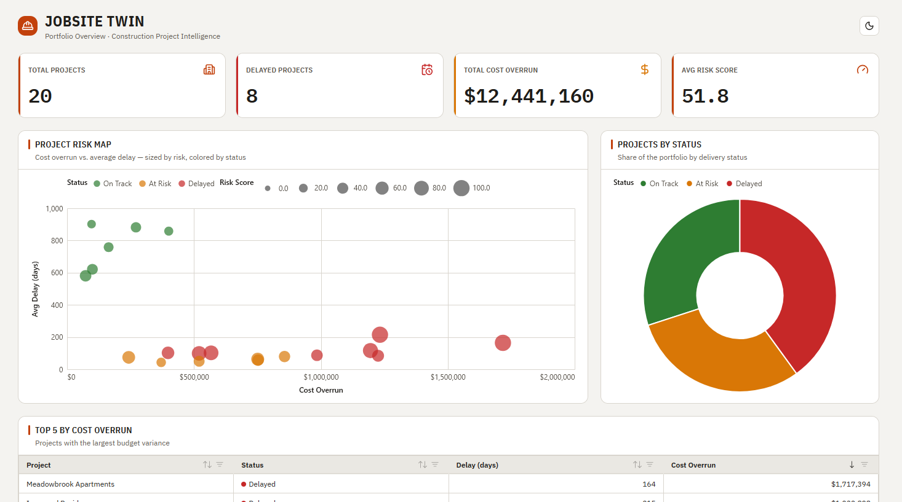
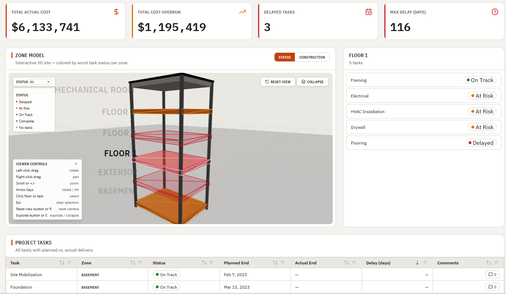

# Jobsite Twin

> **Status:** Public-safe sample after the Task 7.8 security pass. Replace placeholder configuration values before deploying to your own Fabric workspace.

**Jobsite Twin** is a React web app that embeds inside Microsoft Fabric and turns a construction general contractor's Power BI semantic model into two coordinated experiences: a **portfolio overview** across every active project, and a **single-project digital twin** that renders each project's zones as an interactive 3D building.

All data is fetched live from the semantic model via DAX at runtime — there is no static, mock, or cached-to-disk data anywhere in the app.

## Screenshots





## Features

### Portfolio overview
- Headline KPIs (active projects, portfolio cost, overruns, delayed tasks).
- Project **status donut** with click-to-filter (click a slice to filter the scatter; click again to clear).
- **Risk vs. cost scatter** with outlier highlighting and **drill-through** to a single project.
- Top cost-overruns panel.

### Single project detail
- **3D construction digital twin** (react-three-fiber): each project zone becomes a stacked floor slab (Basement at the bottom via `zone_name` parsing), framed by corner columns and a roof cap. Slabs are colored **worst-status-wins** per zone.
- **Exploded view** toggle (top-right) that animates the floors apart, plus a **camera-controls help hint** (bottom-left).
- **Bidirectional selection** with toggle-to-clear: click a floor slab to filter the tasks, or click a task row to highlight its zone in 3D.
- **Per-zone task panel** and a full **tasks grid** with a sortable/filterable **Zone** column whose typography mirrors the 3D floor labels.
- Light/dark theming driven by CSS design tokens.

## Tech stack

| Concern | Choice |
|---|---|
| UI | React 19 + TypeScript, Vite |
| Routing | Local hash router (lazy-loaded project-detail route) |
| 3D | react-three-fiber + drei (three.js) |
| Charts / grid | `@microsoft/fabric-visuals` (Vega-Lite) + `@microsoft/fabric-datagrid` |
| Data | `@microsoft/fabric-app-data` — DAX against a Power BI semantic model |
| Styling | Tailwind v4 `@theme` design tokens |
| Tests | Vitest |

## Getting started

**Prerequisites:** Node.js 22, Azure CLI (`az login`), and access to the target Fabric workspace + semantic model.

```bash
npm install
npm run dev
```

The app can only run fully inside the **Fabric portal embed** flow (it needs a Fabric auth context). Open the item in the Fabric portal and append `&devUri=http://localhost:5173` to the URL to point the embed at your local dev server.

Connections are managed in `fabric.yaml` and generated into `src/fabric.generated.ts`:

```bash
npx fabric-app-data add <alias> --from-url "<Power BI or Fabric URL>"
npx fabric-app-data generate -o src/fabric.generated.ts
```

## Project structure

```
src/
├── App.tsx                     # Router + layout shell
├── components/
│   ├── portfolio/              # Portfolio overview page + panels
│   └── project-detail/         # Single-project page, 3D scene, panels, pure helpers
├── hooks/                      # useSemanticModelQuery, theming, auth
├── lib/                        # Fabric client, toDataTable, utils
└── queries/                    # DAX (.dax) + factory (.ts) modules, grouped by page
```

## Documentation

- [docs/ARCHITECTURE.md](docs/ARCHITECTURE.md) — routing, code-split, the sentinel-substitution query pattern, SDK caching, state model, and shared-lookup helpers.
- [docs/CUSTOMIZATION.md](docs/CUSTOMIZATION.md) — adapting the app to a different semantic model and zone-naming conventions.
- [docs/SECURITY.md](docs/SECURITY.md) — security posture (audit pending before public showcase).
- [AGENTS.md](AGENTS.md) — build workflow and coding conventions for AI agents and contributors.

## License

Licensed under the MIT license. See [LICENSE](LICENSE).